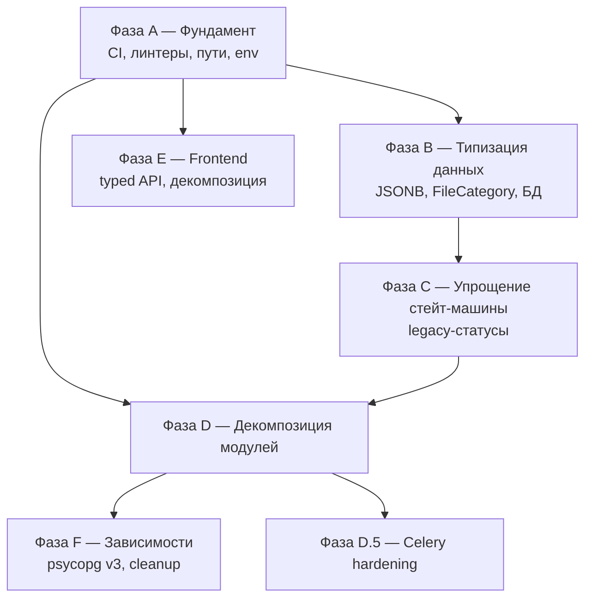

<!--
@file: docs/plans/2026-04-20-audit-section-3-maintainability-roadmap.md
@description: Roadmap по разделу 3 аудита 2026-04-20 — поддерживаемость,
              архитектура, декомпозиция «толстых» модулей, типизация JSONB,
              async/sync граница, нормализация FileCategory, чистка стейт-машины,
              инструменты разработчика, CI, frontend, зависимости, Celery, БД.
@dependencies: docs/project.md (текущая архитектура),
               CLAUDE.md (стейт-машина OrderStatus, соглашения),
               backend/app/services/tasks.py, email_service.py, contract_generator.py,
               backend/app/models/models.py (OrderStatus, FileCategory, ALLOWED_TRANSITIONS),
               backend/app/schemas/tu_schema.py (TUParsedData).
@created: 2026-04-20
-->

# Раздел 3 аудита — Roadmap «Поддерживаемость и архитектура»

> Автор: аудит-2026-04-20. Статус: **План**. Ветка roadmap: `docs/audit-section-3-roadmap`. Реализация — отдельные фичевые ветки и PR по каждой фазе.

---

## 1. Контекст и обоснование

По итогам полного аудита проекта (apr 2026) раздел 3 фиксирует архитектурно-технический долг, накопленный за фазу MVP → Production. Проблемы не блокируют работу пользователей, но:

- тормозят любую новую фичу (изменение одного поведения тянет правки сразу в нескольких «раздутых» файлах);
- повышают риск регрессов из-за нетипизированных JSONB и legacy-статусов;
- мешают масштабированию команды (единое мегаполотно vanilla-JS в `admin.html`, отсутствие CI, низкое покрытие тестами);
- создают скрытые риски в проде (async-эндпоинт блокирует event loop на SMTP, visibility_timeout=86400, отсутствие `task_reject_on_worker_lost`).

Разделы 1 и 2 аудита уже закрыты (ветки `chore/audit-cleanup-docs` и `security/audit-hardening`). Раздел 3 — самый объёмный, выполняется итеративно несколькими PR.

### Цели

1. **Безопасная декомпозиция** «толстых» модулей без изменения пользовательского поведения и без простоя прода.
2. **Типизация данных** (JSONB, FileCategory, legacy-статусы) — чтобы IDE, mypy и Pydantic ловили рассинхрон раньше ревьюера.
3. **Чистая граница async/sync**, исключающая блокировки event loop FastAPI.
4. **CI + автотесты + линтеры** как страховка для всей последующей работы.
5. **Прозрачная граница «инфраструктура vs бизнес»** (пути, ENV, драйверы PG).

### Не-цели

- Смена стека (FastAPI → другой фреймворк, Celery → RQ/arq). Стек остаётся.
- Переписывание `admin.html` с vanilla JS на React в рамках этого roadmap — оценим в Фазе E как отдельный эпик.
- Рефакторинг LLM-пайплайна парсинга ТУ (`tu_schema.py`, prompt-инжиниринг). Это отдельная ветка работ.
- Полная типизация каждой функции под strict mypy. На первом этапе — `mypy --strict` включаем только на вновь написанные модули, остальное `--ignore-missing-imports`.

### Архитектурные принципы (для всех фаз)

- **SRP**: один модуль — одна причина для изменения. Нормально, если вместо 1 файла станет 6 по 200 строк.
- **Public API стабилен**: внешние контракты (URL, Pydantic-схемы ответов, имена Celery-задач, имена enum-значений в БД) меняются **только** с явной Alembic/data-миграцией. Пайлайн `data_complete→…→completed` должен продолжать работать для уже существующих заявок.
- **Каждый шаг — отдельный PR** с атомарными коммитами и тестовым планом.
- **Каждый PR** обязан: (а) не ронять `pytest`, (б) не ломать `docker compose up --build` на dev, (в) иметь запись в `docs/changelog.md` и `docs/tasktracker.md`.
- **Обратная миграция (downgrade)** обязательна для каждого Alembic-скрипта; данные, которые физически нельзя откатить, документируются в шапке миграции.

---

## 2. Глоссарий

| Термин | Значение |
|---|---|
| **SRP** | Single Responsibility Principle — модуль меняется по одной причине. |
| **JSONB** | Бинарный JSON в PostgreSQL. В коде — `sqlalchemy.dialects.postgresql.JSONB`. |
| **Legacy-статус** | `data_complete`, `generating_project`, `review`, `awaiting_contract` — переходные статусы, оставленные «для исторических заявок». |
| **TUParsedData** | Pydantic-модель в `backend/app/services/tu_schema.py`, описывающая структуру `Order.parsed_params`. |
| **ALLOWED_TRANSITIONS** | Словарь допустимых переходов между `OrderStatus` в `backend/app/models/models.py`. |
| **Sync граница** | Места, где из async-функции вызывается блокирующий I/O. Должна быть осознанной (`asyncio.to_thread`) или отсутствовать. |

---

## 3. Зависимости фаз



**Критический путь:** A → B → C → D → F. Фазы E и G идут параллельно: E после A, G после D.

---

## 4. Матрица приоритетов

Оценка: **Impact** — насколько уменьшает технический долг или риск; **Effort** — трудозатраты в чел·днях; **Risk** — шанс регресса.

| ID | Тема | Impact | Effort | Risk | Порядок |
|---|---|:---:|:---:|:---:|:---:|
| A1 | Пути (FRONTEND_DIR, UPLOAD_DIR) через `__file__`/ENV | M | 0.5 | L | 1 |
| A2 | `pyproject.toml` + `ruff` + `mypy` + `pre-commit` | H | 1.5 | L | 2 |
| A3 | GitHub Actions: `pytest` + `ruff` + `mypy` + `npm run build` | H | 1.5 | L | 3 |
| A4 | Frontend: `.env.example`, имя пакета, vitest-skeleton | M | 0.5 | L | 4 |
| B1 | Pydantic-схемы для JSONB, `TypeAdapter` в ORM | H | 3 | M | 5 |
| B2 | Нормализация `FileCategory` → snake_case lowercase + миграция | H | 2 | M | 6 |
| B3 | Переименование старых миграций + индексы `(status, created_at)` | M | 1 | L | 7 |
| C1+C2 ✅ | Data-миграция + удаление `data_complete`/`generating_project`/`review` из enum + упрощение `ALLOWED_TRANSITIONS`. `AWAITING_CONTRACT` оставлен (нужен для payment.html) — **сделано 2026-04-22** | H | 1 | M | 8 |
| D1 | Декомпозиция `tasks.py` → `services/tasks/*.py` | H | 4 | M | 10 |
| D2 | Декомпозиция `email_service.py` → `services/email/*.py` | H | 3 | M | 11 |
| D3 | Декомпозиция `contract_generator.py` → `services/contract/*.py` | H | 3 | M | 12 |
| D4 | Async/sync граница: убрать `SyncSession()` из async-роутеров | H | 2 | M | 13 |
| D5 | Celery: убрать `visibility_timeout=86400`, `task_reject_on_worker_lost=True` | M | 1 | M | 14 |
| E1 ✅ | Typed API через `openapi-typescript`, генерация клиента | H | 1 | L | Параллельно, после A — **сделано 2026-04-22** |
| E2 ✅ | Vitest + тесты на критические утилиты фронта | M | 1 | L | Параллельно — **сделано 2026-04-22** |
| E3 ✅ | `admin.html` — декомпозиция на модули (минимальный вариант, без сборщика) | M | 3 | M | После E1 — **сделано 2026-04-22** |
| E4 ✅ | `upload.html` — аналогично (5 JS-модулей + CSS, обычные `<script>`) | L | 2 | M | После E3 — **сделано 2026-04-22** |
| F1 | Унификация PG-драйвера на `psycopg[binary] v3` | M | 2 | H | Последним |

**Суммарная оценка:** ~35 чел·дней при одной правке за раз + ~10 дней резерв на ревью/починку регрессов ≈ **1.5–2 месяца** wall-time при ~50 % загрузке.

---

## 5. Фаза A — Фундамент

**Цель:** Подготовить инструменты до любого рефакторинга. Без CI и mypy крупный рефакторинг бесконтролен.

### A1. Пути к фронтенду и upload-директории

**Проблема.** `backend/app/main.py:19` содержит `FRONTEND_DIR = Path("/app/frontend-dist")` — абсолютный путь production-контейнера. В dev (uvicorn на хосте) путь не существует, любой SPA-маршрут даёт 404. `Settings.upload_dir = Path("/var/uute-service/uploads")` — аналогичная ситуация.

**Решение.**
- Новое ENV `FRONTEND_DIST_DIR` с дефолтом, вычисляемым относительно `__file__`: `Path(__file__).resolve().parents[2] / "frontend" / "dist"`.
- `UPLOAD_DIR` уже есть в `Settings`, но дефолт тоже привести к относительному пути (`./uploads` для dev, `/var/uute-service/uploads` для prod через ENV).
- `docker-compose.prod.yml` явно задаёт оба ENV. `docker-compose.yml` (dev) — дефолты.

**Шаги.**
1. Добавить в `Settings` поле `frontend_dist_dir: Path` с factory-дефолтом.
2. В `main.py` импортировать `settings.frontend_dist_dir`.
3. Обновить `docker-compose.prod.yml` (добавить `FRONTEND_DIST_DIR=/app/frontend-dist`).
4. Проверить локально: `uvicorn backend.app.main:app --reload` с `FRONTEND_DIST_DIR=frontend/dist` после `cd frontend && npm run build`.
5. Записать в `.env.example`.

**DoD.** Локальный dev-сервер отдаёт SPA без копирования файлов в `/app/frontend-dist`. Prod-сборка не сломалась.

**Risk / rollback.** Низкий. Откат — вернуть старую константу.

---

### A2. `pyproject.toml` + `ruff` + `mypy` + `pre-commit`

**Проблема.** `requirements.txt` без секций, без pinning по хешам, нет формального конфига инструментов. Линтинг и типизация не проверяются.

**Решение.**
- Ввести `backend/pyproject.toml` с секциями `[project]`, `[tool.ruff]`, `[tool.ruff.lint]`, `[tool.mypy]`, `[tool.pytest.ini_options]`.
- Dev-зависимости в `[project.optional-dependencies.dev]`: `ruff`, `mypy`, `pytest`, `pytest-asyncio`, `pytest-cov`, `httpx` (для TestClient), `pre-commit`.
- `pre-commit-config.yaml`: `ruff check`, `ruff format`, `mypy --strict backend/app/services/<новый_модуль>` (именно на новые файлы), `end-of-file-fixer`, `trailing-whitespace`, `check-yaml`, `check-toml`.
- Не трогать существующий `requirements.txt` (prod-образ), но из `pyproject.toml` собрать его через `pip-compile` для воспроизводимости.

**Шаги.**
1. Создать `backend/pyproject.toml`, перенести имя/версию, dev-зависимости.
2. Настроить `ruff` (line-length=100, целевая версия `py312`, select `E,F,W,I,B,UP,RUF,S`).
3. Настроить `mypy`: `strict = false` глобально, но `[[tool.mypy.overrides]]` с `strict = true` для новых модулей (`services.tasks.*`, `services.email.*`, `services.contract.*` по мере появления).
4. Добавить `.pre-commit-config.yaml` и CONTRIBUTING/README-секцию о `pre-commit install`.
5. Прогнать `ruff check backend/` и `ruff format --check backend/`. Для existing-кода допустимы разовые `noqa` с TODO-ссылкой.

**DoD.** `pre-commit run --all-files` проходит. Новые коммиты без ruff-ошибок. `mypy --strict backend/app/services/cors_nothing_yet.py` (после появления первого нового модуля) зелёный.

**Risk / rollback.** Низкий. Инструменты не влияют на runtime.

---

### A3. GitHub Actions CI

**Проблема.** Нет `.github/workflows/`, нет автоматических проверок на PR. Любой регресс ловится только вручную.

**Решение.** Минимальный workflow `.github/workflows/ci.yml`:
1. **Backend job:** `python 3.12`, установить dev-зависимости из `pyproject.toml`, запустить `ruff check` + `mypy` (с warn-only на старые модули) + `pytest backend/tests/`.
2. **Frontend job:** `node 20`, `npm ci` в `frontend/`, `npm run lint` + `npm run build`.
3. **Alembic job:** поднять временный postgres-сервис, прогнать `alembic upgrade head` + `alembic downgrade base` + `alembic upgrade head` — гарантия, что миграции обратимы.
4. Запускать на `push` в любой ветке и на `pull_request` в `main`.

**Шаги.**
1. Создать `.github/workflows/ci.yml`.
2. Добавить `backend/tests/conftest.py` с фикстурами тестовой БД (если нет) — отдельный под-PR, если большой.
3. Добавить бейдж `[]` в `README.md`.

**DoD.** На PR из этой ветки в main CI зелёный. В следующие 3 PR никто не ломает CI без объяснения причины.

**Risk / rollback.** Низкий. Workflow можно выключить через `on:` `workflow_dispatch`.

---

### A4. Frontend baseline

**Проблема.** `frontend/package.json` имя уже поправлено в `chore/audit-cleanup-docs`. Но нет `frontend/.env.example`, нет тестового фреймворка, нет typed API.

**Решение.**
1. `frontend/.env.example` с `VITE_API_BASE_URL=http://localhost:8000`.
2. Добавить `vitest` + `@testing-library/react` + пример теста на калькулятор тарифов (единственная чистая функция).
3. Скрипты `test`, `test:watch` в `package.json`.

**DoD.** `npm test` проходит на 1 тесте. В CI frontend-job запускает `npm test`.

**Risk / rollback.** Низкий.

**Фаза A итого:** ~4 чел·дня, 1 PR на A1, 1 PR на A2+A3 вместе, 1 PR на A4. Блокирующая для всех последующих фаз.

---

## 6. Фаза B — Типизация данных

### B1. Pydantic-схемы для JSONB

**Проблема.** В `Order` четыре JSONB-поля без типизации на уровне ORM:

| Поле | Фактический тип | Используется в |
|---|---|---|
| `parsed_params` | `TUParsedData` | LLM-парсер, админка, `tasks.py`, `contract_generator.py` |
| `survey_data` | свой объект опросника | `upload.html`, `admin.html`, `services/contract_generator.py` |
| `company_requisites` | реквизиты клиента (`full_name`, `inn`, `address`, ...) | email-шаблоны, договор |
| `missing_params` | `list[FileCategory]` | пайплайн |

**Решение.**
- Создать `backend/app/schemas/jsonb/` с Pydantic-моделями: `TUParsedData` (перенести из `services/tu_schema.py`), `SurveyData`, `CompanyRequisites`. `missing_params` — `list[FileCategory]` штатно.
- В ORM `Order` не менять тип колонок (останется `JSONB`), но в слое репозитория/сервисов ввести **типизированные accessor-методы**:

  ```python
  # псевдокод в backend/app/repositories/order_repo.py
  def get_parsed_params(order: Order) -> TUParsedData | None:
      if order.parsed_params is None:
          return None
      return TypeAdapter(TUParsedData).validate_python(order.parsed_params)

  def set_parsed_params(order: Order, data: TUParsedData) -> None:
      order.parsed_params = data.model_dump(mode="json")
  ```

- `OrderResponse` (Pydantic-схема API) → строго типизированные подполя вместо `dict`. Это **breaking change для фронта**, но поля те же, просто формально типизированные — фронт скорее всего переживёт; typed API (E1) это проверит.
- Данные валидируются **при чтении**, не при записи LLM-результата (чтобы не падать на чужом формате — логируем и отмечаем `parsed_params=None`).

**Шаги.**
1. Перенести `TUParsedData` в `schemas/jsonb/tu.py`, сохранить backward-compat импорт.
2. Написать `SurveyData`, `CompanyRequisites` по образцу фактических форм в `upload.html` и админке.
3. Ввести accessor-методы. Обновить все места чтения (`admin.py`, `landing.py`, `contract_generator.py`, `email_service.py`).
4. Привести `OrderResponse` к строгой типизации.
5. Тесты: валидация синтетических примеров старых/кривых `parsed_params`, что fallback к `None` срабатывает корректно.

**DoD.** `mypy --strict` зелёный на всех читающих `parsed_params` / `survey_data` / `company_requisites`. Никакого `order.parsed_params["heat_loads"]["heating_load"]` в бизнес-коде — только через accessor.

**Risk.** Средний. Существующие заявки могут содержать устаревшие ключи (после прежних эволюций LLM-промпта). Mitigation — валидатор с `extra="ignore"` и логом WARNING + метрика «сколько заявок не прошли строгую валидацию».

**Rollback.** Отключить строгую валидацию на уровне конфига, `parsed_params` возвращать `dict`. Accessor-методы остаются.

---

### B2. Нормализация `FileCategory`

**Проблема.** Enum — смесь регистров:

```python
TU = "tu"
BALANCE_ACT = "BALANCE_ACT"
CONNECTION_PLAN = "CONNECTION_PLAN"
HEAT_POINT_PLAN = "heat_point_plan"
HEAT_SCHEME = "heat_scheme"
GENERATED_EXCEL = "generated_excel"
COMPANY_CARD = "company_card"
SIGNED_CONTRACT = "signed_contract"
...
```

API принимает `?category=tu` и `?category=BALANCE_ACT`, но `?category=balance_act` — нет. Это путает и фронт, и внешних клиентов.

**Решение.** Единый стандарт — **snake_case lowercase**. Все uppercase-значения мигрировать в lowercase, обновить Python enum и все места использования.

**Шаги.**
1. Alembic-миграция данных `UPDATE files SET category = lower(category) WHERE category IN ('BALANCE_ACT', 'CONNECTION_PLAN', ...)`. Обёрнуть в `ALTER TYPE ... RENAME VALUE ... TO ...` (PostgreSQL 10+ поддерживает) либо через новый enum + CAST + DROP old.
2. Поменять `FileCategory` в Python-коде на lowercase.
3. Обновить фронт (`admin.html`, `upload.html`): если есть упоминания `BALANCE_ACT` в JS — привести к lowercase.
4. Регрессионный тест: старый API-клиент с uppercase-значениями **получает 422** (т. е. явно сигнализируется о поломке контракта) — это ожидаемое изменение, задокументировать в changelog.
5. Alt-план: принять оба варианта 1 релиз (`Field(alias=...)`, `__get_pydantic_json_schema__` с lowercase preferred), затем убрать uppercase во втором релизе. Решить на старте PR.

**DoD.** `SELECT DISTINCT category FROM files` возвращает только lowercase-значения. Все API-запросы с uppercase отвечают `422 Unprocessable Entity` (или в alt-плане — канонизируются в lowercase с `deprecation_warning`).

**Risk.** Средний. Мigrate данных в проде требует окно обслуживания (или zero-downtime через двойное чтение).

**Rollback.** Данные откатываются обратной миграцией `UPDATE ... SET category = upper(...)`. Python-код откатывается git revert.

---

### B3. Миграции: именование + индексы

**Проблема 1 — имена.**
Соглашение из `CLAUDE.md`: `YYYYMMDD_uute_<описание>.py`. Нарушают:

- `8867df9549c4_add_order_type_and_survey_data.py`
- `rename_standard_to_custom_order_type.py`

**Проблема 2 — индексы.** В моделях нет индексов кроме `order_id/status/client_email`. С ростом до десятков тысяч заявок будет болеть сортировка админского списка.

**Решение.**
- Alembic позволяет переименовать файлы миграций, **если** `down_revision` совпадает и ревизии не изменяются. Аккуратно переименовать два файла, проверить `alembic upgrade head` и `alembic downgrade` на чистой БД.
- Добавить индексы:
  - `ix_orders_created_at` (`Order.created_at`, DESC)
  - `ix_orders_status_created_at` (`Order.status`, `Order.created_at DESC`) — для админских listing с фильтром по статусу
  - `ix_files_order_id_category` (`File.order_id`, `File.category`) — частый запрос «файлы заявки X по категории Y»
  - `ix_emails_sent_order_id_event_type_uidx` — если ещё нет (идемпотентность)
- Миграция **только создаёт индексы `CONCURRENTLY`** (в Alembic через `op.create_index(..., postgresql_concurrently=True)` + autocommit_block) — чтобы не блокировать таблицу в проде.

**Шаги.**
1. Переименовать 2 миграции, сверить `alembic history --verbose` до/после.
2. Новая миграция `20260420_uute_add_order_listing_indexes.py` с `postgresql_concurrently=True`.
3. `EXPLAIN ANALYZE` на типичном админском запросе до/после — приложить в PR.

**DoD.** `alembic history` показывает чистые имена. Новый индекс используется планировщиком PG (`EXPLAIN` показывает `Index Scan using ix_orders_status_created_at`).

**Risk.** Низкий. `CONCURRENTLY` безопасен для прода.

**Фаза B итого:** ~6 чел·дней, 3 PR. Блокирующая для Фазы C.

---

## 7. Фаза C — Упрощение стейт-машины

> **Обновление 2026-04-21 (см. § 13.1, п.1).** В проде заявок в legacy-статусах нет; все записи в `orders` тестовые и удаляемы. Поэтому C1 теряет data-миграцию (backfill не нужен), а C2 может сразу пересоздавать enum. Фактически C1 + C2 можно слить в один PR, если так удобнее. Ниже — исходная детализация для истории.

### C1. Data-миграция legacy-статусов

**Проблема.** В `OrderStatus` 14 значений, 4 помечены как legacy:

- `data_complete`
- `generating_project`
- `review`
- `awaiting_contract`

`ALLOWED_TRANSITIONS` поддерживает оба пути, `pipeline.py:154` смешивает ветки (`if order.status in (ADVANCE_PAID, REVIEW)`), админ UI обязан рендерить оба.

**Решение.**
- Инвентаризация: `SELECT status, count(*) FROM orders GROUP BY status` — понять, сколько заявок в каждом legacy-статусе.
- Для каждого legacy-статуса определить актуальный целевой статус:
  - `data_complete` → `generating_project` → `review` → `awaiting_contract` — вся цепочка сохраняется **семантически**, но переход от `new` не проходит через них в новом флоу. Вероятно, нужно: заявки в `data_complete` и дальше уже прошли этап ТУ и клиента, значит их логично перевести в новую ветку на тот же семантический шаг. Предложение: `data_complete` → `generating_project` остаются как **alias** (внутренние), а фронт их не показывает. Либо все 4 переименовываются в `*_legacy` в БД и новые заявки их не используют.
  - Финальное решение — **согласовать с владельцем продукта в рамках PR** (добавить чек-лист «какие заявки на каком шаге сейчас живут»).
- Data-миграция с backfill-скриптом, обёрнутым в autocommit_block (как уже делали в `20260416_uute_rso_remarks_status.py`).
- **Обратимость:** миграция сохраняет оригинальный статус в новой колонке `orders.legacy_status_before_migration` (nullable), которую удалим в C2. Откат возвращает статус.

**Шаги.**
1. Анализ выборки (отчёт в PR с `COUNT BY status`).
2. Согласование маппинга legacy → actual с продактом.
3. Миграция с backfill + тесты.
4. Логирование действия в `docs/changelog.md` отдельной записью в секции «Безопасность».

**DoD.** После миграции `SELECT count(*) FROM orders WHERE status IN (data_complete, generating_project, review, awaiting_contract)` == ожидаемое число (0, либо только «разрешённые остаться»).

**Risk.** Средний. Ошибочный маппинг уронит пайплайн для части живых заявок. Mitigation — dry-run на копии БД, ручная проверка 5–10 репрезентативных заявок.

---

### C2. Удаление legacy из enum

**Проблема.** После C1 живых заявок в legacy-статусах нет (или они sanitized). Но enum в Python и PostgreSQL `orderstatus` их всё ещё содержит.

**Решение.**
- Alembic-миграция `ALTER TYPE orderstatus DROP VALUE ...` — **не поддерживается PostgreSQL напрямую**. Нужно пересоздать тип:
  1. Создать `orderstatus_v2` без legacy.
  2. `ALTER TABLE orders ALTER COLUMN status TYPE orderstatus_v2 USING status::text::orderstatus_v2`.
  3. `DROP TYPE orderstatus`, `ALTER TYPE orderstatus_v2 RENAME TO orderstatus`.
- Эту миграцию обернуть в autocommit_block + заранее проверить на копии.
- Упростить `ALLOWED_TRANSITIONS`, убрать ветки legacy.
- Упростить `pipeline.py:154` (`approve`) — убрать ветку `REVIEW`, оставить только `ADVANCE_PAID`.
- Обновить `admin.html` — убрать кнопки/метки для legacy-статусов.

**Шаги.**
1. Миграция пересоздания enum.
2. Рефакторинг `ALLOWED_TRANSITIONS` + тесты на все текущие переходы.
3. Очистка `admin.html`.
4. Обновить диаграмму `CLAUDE.md` (она уже обновлена в `chore/audit-cleanup-docs`, но сверить).

**DoD.** `enum_range(NULL::orderstatus)` возвращает только актуальные значения. `pytest` на `ALLOWED_TRANSITIONS` зелёный.

**Risk.** Средний. Если в проде всё-таки есть заявка с legacy-статусом (пропущенный случай) — миграция упадёт. Mitigation — C1 + явная проверка перед C2.

**Фаза C итого:** ~3 чел·дня, 2 PR. Блокирующая для чистого D1.

---

## 8. Фаза D — Декомпозиция «толстых» модулей

**Общий подход ко всем D1–D3:**

- **Без изменения поведения.** Сначала split, потом оптимизация.
- Каждая функция переезжает вместе со своими тестами (если они есть) или с одновременным добавлением теста.
- Переезд — атомарный коммит на модуль: `Move X from tasks.py to tasks/tu_parsing.py`. Ревьюер сверяет, что код идентичен.
- Публичные импорты сохраняются: в исходном файле оставить `from .subpackage.module import X` для backward-compat 1 релиз, затем удалить.

---

### D1. `services/tasks.py` → `services/tasks/{tu_parsing,contract_flow,post_project_flow,reminders,_common}.py`

**Проблема.** 1743 строки, 70 КБ. В одном файле переплетены:
- Celery-задачи парсинга ТУ (`parse_tu_task`, `process_new_order_task`).
- Email-задачи (`send_*_email_task` — куча).
- Контрактный флоу (`generate_contract_task`, `send_contract_task`).
- Post-project (`send_final_project_task`, `handle_rso_remarks_task`).
- Reminder'ы через Celery Beat (`daily_reminders`, `process_due_info_requests`).
- Общие helpers (`_get_order_sync`, `_mark_email_sent` и пр.).

**Решение — пакет `services/tasks/`:**

```
backend/app/services/tasks/
├── __init__.py          # re-export'ы для Celery autodiscovery + backward-compat
├── _common.py           # SyncSession factory, helpers, шаг записи EmailsSent
├── tu_parsing.py        # parse_tu_task, process_new_order_task
├── client_response.py   # задачи вокруг waiting_client_info → client_info_received
├── contract_flow.py     # generate_contract_task, send_contract_task, advance_paid watcher
├── post_project_flow.py # send_final_project_task, handle_rso_remarks_task, повторная отправка
└── reminders.py         # daily_reminders, process_due_info_requests, final_payment_reminder
```

**Шаги (порядок коммитов).**
1. Создать `services/tasks/__init__.py`, который `from .tu_parsing import *` и т. д. (пока пустые подмодули). Celery registry не ломается, т. к. имена задач остаются прежними — но нужно проверить `celery_app.autodiscover_tasks`. Возможно, потребуется явный `include` в `celery_app.py`.
2. Перенести `_common.py` (helpers, SyncSession, маркеры идемпотентности `EmailsSent`).
3. Перенести `tu_parsing.py`.
4. Перенести `contract_flow.py`.
5. Перенести `post_project_flow.py`.
6. Перенести `reminders.py`.
7. Перенести `client_response.py`.
8. В старом `tasks.py` остаются только re-export'ы `from .tasks.* import *` с `# noqa: F401` для 1 релиза, потом удаляем.

**DoD.**
- `from backend.app.services.tasks import parse_tu_task` продолжает работать.
- Celery worker при старте логирует **все** прежние задачи (`celery -A backend.app.core.celery_app inspect registered`).
- Поведение dev-пайплайна без изменений (smoke-скрипт создания заявки → готовый проект).

**Risk.** Средний. Неправильный re-export → Celery теряет задачу в registry → сообщения в очереди остаются без обработчика.

**Rollback.** `git revert` возвращает один файл.

---

### D2. `services/email_service.py` → `services/email/{service,renderers,smtp,idempotency}.py`

**Проблема.** 36 КБ. В одном файле: ~17 типов писем, Jinja2-окружение, SMTP-клиент, идемпотентность через `EmailsSent`, локализация сумм.

**Решение — пакет:**

```
backend/app/services/email/
├── __init__.py
├── service.py       # EmailService (публичный API, используемый в tasks.py и роутерах)
├── renderers.py     # Jinja2 env, функции render_*(context)
├── smtp.py          # SMTPClient (обёртка над smtplib с retry)
├── idempotency.py   # is_already_sent(order_id, event_type), mark_sent(...)
└── templates/       # (остаётся там же, где сейчас, если в backend/app/templates/emails)
```

**Шаги.**
1. Выделить `SMTPClient` (чистый wrapper вокруг `smtplib.SMTP_SSL` с ретраями и контекст-менеджером).
2. Выделить `renderers.py` — Jinja2 env + функции рендера. `from jinja2 import Environment, FileSystemLoader`.
3. Выделить `idempotency.py` — единая точка маркера, с SQLAlchemy.
4. `service.py` — `class EmailService` собирает rendered body + from SMTPClient отправляет.
5. В старом `email_service.py` re-export'ы (1 релиз).

**DoD.** 17 существующих шаблонов уходят без изменения содержания. `pytest` на ключевых шаблонах (договор, уведомление инженеру, скан РСО) — зелёный.

**Risk.** Средний. SMTP Яндекс иногда отвечает таймаутом — отделённый `SMTPClient` должен сохранить текущие retry/логику, иначе пропадёт устойчивость.

---

### D3. `services/contract_generator.py` → `services/contract/{docx_builder,invoice,tu_embed,number_format}.py`

**Проблема.** 76 КБ. В одном файле: договор, счёт, встраивание PDF ТУ в DOCX через PyMuPDF с лестницей DPI, локализация чисел в русский формат.

**Решение — пакет:**

```
backend/app/services/contract/
├── __init__.py
├── docx_builder.py   # сборка DOCX по шаблону kontrakt_ukute_template.md
├── invoice.py        # счёт (advance / final)
├── tu_embed.py       # вставка PDF-страниц ТУ как PNG, лестница DPI, лимит 25 МБ
└── number_format.py  # rus_currency, склонения рубль/копейка, пропись
```

**Шаги.**
1. Вынести `number_format.py` — самодостаточный.
2. Вынести `tu_embed.py` — PyMuPDF-логика, публичная функция `embed_tu_pages(doc: Document, tu_pdf_path: Path, max_size_mb: float = 25)`.
3. Вынести `invoice.py` — `build_invoice(kind: Literal["advance", "final"], order: Order) -> bytes`.
4. Вынести `docx_builder.py` — `generate_contract_docx(order: Order, ...) -> Path`.
5. В старом `contract_generator.py` — re-export'ы (1 релиз), потом удалить.

**DoD.** Сгенерированный DOCX бинарно совпадает с предыдущим (sha256 на фиксированных входных данных). `pytest` на типичном сценарии (2-страничный ТУ) — зелёный.

**Risk.** Средний. `python-docx` чувствителен к порядку добавления стилей; перенос функций может изменить order → визуальный регресс. Mitigation — baseline sha256 на фикстуре.

---

### D4. Async/sync граница

**Проблема.** В async-роутерах (`backend/app/api/landing.py:147`, `backend/app/api/emails.py:127`) открывается `with SyncSession() as sync_session:` и внутри может уходить SMTP-вызов. Это блокирует FastAPI event loop на секунды.

**Решение.**
- Все тяжёлые блокирующие операции (SMTP, генерация DOCX, PyMuPDF) **должны быть Celery-задачами**. Async-роутер только публикует задачу (`.delay(...)`) и возвращает `202 Accepted` либо ждёт inline через `asyncio.to_thread`.
- Где результат нужен синхронно в ответе (редкий случай) — обернуть в `await asyncio.to_thread(func, ...)`.
- Прямое `SyncSession()` в async-функции — запрещено правилом `ruff` (custom rule или grep в CI).

**Шаги.**
1. Аудит всех `with SyncSession()` в `backend/app/api/` (сейчас 2 точки — `landing.py` и `emails.py`, проверить остальные).
2. Каждый случай:
   - если это уведомление (email) — всегда `.delay(...)` через Celery;
   - если это чтение — мигрировать на `async_session`;
   - если операция лёгкая (<50 мс) и нужна атомарность в пределах HTTP-ответа — `await asyncio.to_thread(sync_fn, ...)`.
3. Добавить CI-проверку: `rg -n "SyncSession\(\)" backend/app/api/` → non-empty = fail.

**DoD.** `rg SyncSession backend/app/api/` возвращает 0 совпадений. Event loop не блокируется (проверить `py-spy top` на worker'е под нагрузкой).

**Risk.** Средний. Если раньше endpoint был атомарным (запись в БД + отправка email), а теперь отправка email становится best-effort (`delay()`), это меняет UX-гарантии. В PR явно зафиксировать, где мы теряем атомарность, и согласовать.

---

### D5. Celery hardening

**Проблема.**
- `celery_app.py:23` — `visibility_timeout=86400` из-за 24-часового `countdown` для `info_request`. Любая неудачная `acks_late`-задача висит сутки.
- Нет `task_reject_on_worker_lost=True` — при OOM-kill задача потеряется.
- Нет структурированного логирования.

**Решение.**
- Убрать `countdown=86400` для `info_request`. Уже есть `process_due_info_requests` Celery Beat (каждые 5 мин) + таблица «отложенных событий» — используем её.
- Вернуть стандартный `visibility_timeout` (3600 с = 1 ч).
- `task_reject_on_worker_lost = True` в конфиге.
- `task_acks_late = True` уже должно быть — проверить.
- Опционально: подключить Sentry SDK (отдельный PR), чтобы Celery-исключения попадали в Glitchtip/Sentry. Поверх — `structlog` для JSON-логов на проде.

**Шаги.**
1. Инвентаризация использований `countdown=86400` → заменить на `scheduled_events` (таблица + Beat-джоб).
2. Обновить `celery_app.py` с новым `visibility_timeout`, `task_reject_on_worker_lost`.
3. `alembic` миграция на новую таблицу `scheduled_events(event_type, payload, scheduled_for, processed_at)`, если её ещё нет — там уже есть `EmailsSent`, посмотреть, не дублируется ли.
4. Smoke-тест: создать заявку, убедиться, что через 24 ч (или симулированное время в тестах) `info_request` уходит.

**DoD.** `visibility_timeout` в конфиге `≤ 3600`. `task_reject_on_worker_lost = True`. Все `apply_async(countdown=...)` с большим значением заменены.

**Risk.** Средний. Если `process_due_info_requests` не покрывает все кейсы, письма могут не уйти. Mitigation — перед удалением `countdown` убедиться, что Beat-джоб видит все события.

**Фаза D итого:** ~13 чел·дней, 5 PR (D1, D2, D3, D4, D5). Самая объёмная.

---

## 9. Фаза E — Frontend

### E1. Typed API через `openapi-typescript` ✅ (2026-04-22)

**Проблема.** `frontend/src/api.ts` вручную дублировал Pydantic-схемы. Рассинхрон гарантирован при любом изменении бэкенда.

**Решение (реализовано).**
- Скрипт [`scripts/generate-api-types.sh`](../../scripts/generate-api-types.sh) — без поднятия HTTP-сервера: импортирует FastAPI `app` и вызывает `app.openapi()` напрямую, затем `openapi-typescript`.
- Артефакты [`frontend/src/api/openapi.json`](../../frontend/src/api/openapi.json) и [`frontend/src/api/types.ts`](../../frontend/src/api/types.ts) коммитятся в репо.
- [`frontend/src/api.ts`](../../frontend/src/api.ts) использует `components['schemas'][…]` вместо ручных интерфейсов. Сигнатуры публичных функций сохранены — компоненты не трогали.
- CI-job `api-types-drift` в [`.github/workflows/ci.yml`](../../.github/workflows/ci.yml): перегенерация + `git diff --exit-code`.

**DoD выполнен.** Любое переименование поля в Pydantic → фронт-билд падает по TS-ошибке, CI — по drift-check.

**Risk.** Низкий.

---

### E2. Vitest + тесты ✅ (2026-04-22)

**Что сделано.** Vitest уже был установлен (5 тестов на `utils/pricing.ts`). Добавлен новый модуль [`frontend/src/api.test.ts`](../../frontend/src/api.test.ts) (10 тестов) — фиксирует контракт транспортного слоя:
- URL/метод/заголовки/сериализация тела для `requestSample`, `createOrder`, `sendPartnershipRequest`, `sendKpRequest`;
- разбор ошибок FastAPI: строковый `detail`, валидационный массив `[{msg}]`, HTTP-fallback;
- multipart-контракт `kp-request` (Content-Type не ставится вручную);
- override `VITE_API_BASE_URL` через `vi.stubEnv` + динамический импорт модуля.

**Решение не требует `@testing-library/react` и `jsdom`:** Node 20 содержит нативные `fetch`/`FormData`, мок делается через `vi.stubGlobal`. Компонентные тесты (модалки) — отложены до фазы E3/E4, когда в них появится нетривиальная логика.

**DoD выполнен.** `npm test` в CI зелёный, 15/15 тестов (было 5).

---

### E3. `admin.html` декомпозиция ✅ (2026-04-22, минимальный вариант)

**Что сделано.** `backend/static/admin.html` (**129 645 → 13 131 байт, −90%**) разрезан на HTML-скелет + внешний CSS + 5 JS-файлов в `backend/static/js/admin/`:

| Файл | Ответственность |
|------|-----------------|
| [`css/admin.css`](../../backend/static/css/admin.css) (~18 KB) | весь прежний inline `<style>` |
| [`js/admin/config.js`](../../backend/static/js/admin/config.js) (~7 KB) | `API_BASE`, `ORDER_ID_URL_RE`, `STATUS_LABELS/COLORS/ORDER`, `POST_PARSE_STATUSES`, `SURVEY_LABELS/VALUE_MAP/SECTIONS`, глобальное состояние поллингов |
| [`js/admin/utils.js`](../../backend/static/js/admin/utils.js) (~3.5 KB) | `statusBadge`, `orderTypeBadge`, `formatNum`/`fmtNum`, `esc`, `formatDate*`, `formatSize`, `addKeyToUrl`, `isParsedParamsEmpty`, `showOrderAlert` |
| [`js/admin/views-parsed.js`](../../backend/static/js/admin/views-parsed.js) (~28 KB) | рендер parsed_params, опросного листа и сравнительной таблицы (`cmp*`, `buildParsedParamsTablesHtml`, `renderParsedParams`, `renderSurveyData`, `*FromParams`) |
| [`js/admin/views-calc.js`](../../backend/static/js/admin/views-calc.js) (~16 KB) | настроечная БД вычислителя (`loadCalcConfig`, `renderCalcConfig`, `renderCalcGroups`, `initCalcConfig*`, `saveCalcConfig`, `exportCalcConfigPdf`, `calcParamChanged` + UI-state) |
| [`js/admin/admin.js`](../../backend/static/js/admin/admin.js) (~44 KB) | entry: auth, `apiFetch`/`apiJSON`, навигация, 4 поллинга, `approveProject`, список заявок, карточка заявки, действия, `DOMContentLoaded` |

**Ключевое решение — обычные `<script>`, не ES-модули.** В `admin.html` 15 inline `onclick`/`onchange` вызывают 12 глобальных функций (`doLogin`, `doLogout`, `refreshList`, `showList`, `showOrderScreen`, `uploadAdminFile`, `initCalcConfig*`, `saveCalcConfig`, `exportCalcConfigPdf`, `calcParamChanged`, `addKeyToUrl`). Если бы перешли на `<script type="module">`, все top-level-идентификаторы стали бы module-private, и пришлось бы либо переписывать inline-хендлеры, либо расклеивать функции по `window.*`. Вместо этого загружаем файлы как обычные скрипты — top-level `function`/`const`/`let` остаются глобальными. Код перенесён 1-в-1 без переименований и реорганизации.

**Порядок подключения (обязателен):** `config.js → utils.js → views-parsed.js → views-calc.js → admin.js`. Это гарантирует, что все зависимости определены до первого вызова из `DOMContentLoaded`.

**Проверки.**
- `node --check` на каждом из 5 модулей — чистый синтаксис.
- `python3 -m http.server` по `backend/static/`: HTTP 200 на `/admin.html`, `/css/admin.css` и всех пяти `/js/admin/*.js`.
- Аудит: все 12 функций, вызываемых из inline `onclick` в HTML, присутствуют в модулях.

**DoD.** Файл `admin.html` уменьшился до <30 КБ (skeleton + подключение модулей). ✅ (13 KB фактически).

**Не вошло в «минимальный» вариант.** Сборщик (esbuild/Vite), ES-модули, миграция на React, eslint-правила для `backend/static/js/` — при необходимости отдельными фазами.

**Risk.** Средний → фактически низкий: кода не менялся, статика теперь проще ревьюить.

---

### E4. `upload.html` декомпозиция

То же, что E3, но для `upload.html`. Отдельный PR.

**Фаза E итого:** ~7 чел·дней. E1/E2 блокируют E3/E4.

---

## 10. Фаза F — Зависимости

### F1. Унификация PG-драйвера

**Проблема.** `requirements.txt`: `asyncpg==0.29.0` + `psycopg2-binary==2.9.9`. Две разные библиотеки — два набора багов, два набора квирков.

**Решение.** Перейти на **`psycopg[binary]>=3.1`** — единая либа, поддерживает sync и async.

**Шаги.**
1. Заменить в `requirements.txt`.
2. В `backend/app/core/db.py` / `celery_app.py` сменить строки подключения: `postgresql+psycopg://...` (или `postgresql+psycopg_async://...`).
3. Прогнать `pytest` и smoke-тесты.
4. Прогнать миграции `upgrade → downgrade → upgrade`.
5. Нагрузочный тест на dev (ab/wrk) — сравнить RPS.

**DoD.** `requirements.txt` не содержит `asyncpg` и `psycopg2-binary`. Все существующие сценарии работают. Сравнительная таблица RPS приложена в PR.

**Risk.** Высокий (поэтому ставится последним). `asyncpg` местами быстрее `psycopg3 async`. Потенциальные инкомпатимости в `executemany`, `COPY`, специфике connection pool.

**Rollback.** `git revert` + `pip install` старых версий.

**Фаза F итого:** ~2 чел·дня + резерв на bug-fix.

---

## 11. Критерии готовности всего раздела (DoD)

- [ ] Все 11 подпунктов (3.1–3.11) закрыты отдельными PR.
- [ ] CI зелёный на `main`, не отключался на зелёном ни разу за 2 недели.
- [ ] `mypy --strict` включён хотя бы на: `services/tasks/*`, `services/email/*`, `services/contract/*`, `schemas/jsonb/*`, `repositories/*`.
- [ ] `pytest` покрытие backend ≥ 40 % (стартовое — оценить до, но прирост обязательный).
- [ ] Диаграмма в `CLAUDE.md` и `docs/project.md` отражает актуальную структуру `services/`.
- [ ] `docs/changelog.md` содержит секции по каждой закрытой подзадаче.
- [ ] Zero legacy-статусов в БД на проде (проверка SQL в конце Фазы C).

---

## 12. Риски и митигация (сводно)

| Риск | Вероятность | Последствия | Mitigation |
|---|---|---|---|
| Celery теряет задачу после разнесения `tasks.py` | M | Прод-регрес | `autodiscover_tasks` + явный `include=` + smoke на dev до merge |
| Data-миграция legacy-статусов ломает живые заявки | M | Проект не генерится для части клиентов | Dry-run на dump проды, ручная проверка выборки, backfill-колонка |
| `psycopg3` медленнее `asyncpg` | M | Падение RPS | Нагрузочный тест ДО PR, откладываем в последнюю фазу |
| Переезд `contract_generator` ломает вёрстку DOCX | L | Клиент получит неправильно оформленный договор | sha256 baseline на фикстуре в тестах |
| CI на GitHub слишком медленный | L | Ревьюеры ждут | Разнесение на параллельные jobs (backend/frontend/alembic) |

---

## 13. Открытые вопросы (для обсуждения до старта)

1. **Legacy-статусы:** сколько заявок в проде сейчас висит в `data_complete` и соседних? От ответа зависит план C1.
2. **FileCategory нормализация:** одношаговая breaking-change или постепенная (2 релиза)?
3. **`admin.html` декомпозиция:** минимальный вариант (модули) или сразу миграция на React? Последнее — отдельный эпик ~10 чел·дней.
4. **Sentry/Glitchtip:** подключаем в рамках Фазы D.5 или отдельной задачей после?
5. **`psycopg3` переход:** делаем сейчас или откладываем на Q3/Q4 (приоритет низкий, выигрыш в читаемости, не в производительности)?
6. **CI provider:** GitHub Actions (бесплатно до 2000 мин/мес на private) или Gitea/GitLab self-hosted?
7. **Coverage gate:** ставить ли failing-билд при падении coverage ниже X%? Если да — какой стартовый X?

---

## 13.1. Принятые решения (2026-04-21)

1. **Legacy-статусы (вопрос 1):** живых заявок в legacy-статусах нет — все записи в `orders` тестовые, допускается полное удаление. Фаза **C упрощается**: C1 превращается в разовую очистку тестовых заявок и дроп легаси из `ALLOWED_TRANSITIONS`; C2 делает `ALTER TYPE orderstatus` без data-migration/backfill.
2. **FileCategory нормализация (вопрос 2):** делаем **в два релиза** (non-breaking → breaking). Детальный план — см. раздел «B2 (актуализация)» ниже.
3. **`admin.html` декомпозиция (вопрос 3):** ответ **отложен**. Пока планируем минимальный вариант (модули без React). Перед стартом фазы E3 решение подтвердим отдельно.
4. **Sentry/Glitchtip (вопрос 4):** отложено — отдельной задачей **после** фазы D.
5. **`psycopg3` (вопрос 5):** отложено в Q3/Q4. Фаза F1 остаётся в roadmap, но не запускается в рамках текущего цикла.
6. **CI provider (вопрос 6):** **GitHub Actions** (репозиторий уже там).
7. **Coverage gate (вопрос 7):** на старте — **без fail-порога**, только отчёт в CI; порог введём, когда покрытие стабилизируется.

> Пункты 4/5/6/7 — предложены по умолчанию, ждут финального подтверждения продактом в первом PR фазы A.

---

## 14. Последовательность PR (предлагаемый план)

Итого **~18 PR** за 1.5–2 месяца wall-time:

1. `chore/audit-a1-paths` — A1
2. `chore/audit-a2-dev-tools` — A2 (pyproject, ruff, mypy, pre-commit)
3. `chore/audit-a3-ci` — A3 (GitHub Actions)
4. `chore/audit-a4-frontend-baseline` — A4
5. `feat/audit-b1-jsonb-schemas` — B1
6. `feat/audit-b2-file-category-normalize` — B2
7. `chore/audit-b3-migrations-cleanup-indexes` — B3
8. `feat/audit-c1-legacy-statuses-migration` — C1
9. `feat/audit-c2-legacy-statuses-drop` — C2
10. `refactor/audit-d1-tasks-split` — D1
11. `refactor/audit-d2-email-split` — D2
12. `refactor/audit-d3-contract-split` — D3
13. `refactor/audit-d4-async-sync-boundary` — D4
14. `fix/audit-d5-celery-hardening` — D5
15. `feat/audit-e1-typed-api` — E1
16. `feat/audit-e2-frontend-tests` — E2
17. `refactor/audit-e3-admin-html-modules` — E3 (минимальный вариант)
18. `refactor/audit-f1-psycopg3` — F1

Порядок можно менять внутри фазы, но **приоритет A → B → C → D остаётся строгим**, иначе декомпозиция D вне типизации B даст хрупкий результат.

---

## 15. Следующий шаг

1. Согласовать с продактом ответы на «Открытые вопросы» (секция 13).
2. Завести `docs/tasktracker.md` запись «Раздел 3 аудита — план утверждён» со статусом `Не начата`.
3. Открыть первый PR — `chore/audit-a1-paths` (самый дешёвый и безрисковый, «разогрев»).
