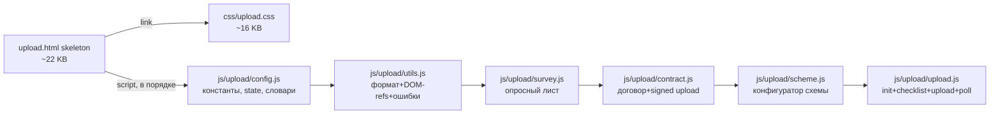
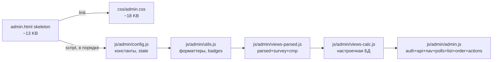

# УУТЭ Проектировщик — архитектура (фрагмент)

> Технический и продуктовый долг, хвосты завершённых фаз аудита,
> отложенные решения — в [`docs/backlog.md`](backlog.md). Стратегический
> план — в
> [`docs/plans/2026-04-20-audit-section-3-maintainability-roadmap.md`](plans/2026-04-20-audit-section-3-maintainability-roadmap.md).
> Хронология выполненных задач — в [`docs/tasktracker.md`](tasktracker.md).

## Публичный фронтенд (React SPA)

Контактные данные и юридические реквизиты на лэндинге задаются в [`frontend/src/constants/siteLegal.ts`](../frontend/src/constants/siteLegal.ts): `SITE_CONTACT` используется в подвале и в секции «Свяжитесь с нами» (`Footer`, `PartnerFormSection`), `SITE_REQUISITES` — только в подвале.

Сборка Vite кладётся в `frontend/dist`; в production образ монтируется в контейнер как `/app/frontend-dist` (`docker-compose.prod.yml`). FastAPI в [`backend/app/main.py`](../backend/app/main.py) отдаёт `index.html` для путей вне зарегистрированных маршрутов (`/{full_path:path}` регистрируется последним) и статику `/assets` из той же папки. Явные маршруты `/api/v1/*`, `/health`, `/upload/{id}`, `/admin`, `/static` имеют приоритет.

Файлы из [`frontend/public/`](../frontend/public/) попадают в корень статики: опросный лист для скачивания с лендинга — [`/downloads/opros_list_form.pdf`](../frontend/public/downloads/opros_list_form.pdf) (единственная копия PDF; ранее дубль лежал в `docs/` и был удалён, чтобы не плодить расхождения). В production [`backend/app/main.py`](../backend/app/main.py) для путей вне `/api`, `/upload`, `/admin`, `/static`, `/assets` сначала проверяет наличие **реального файла** в `frontend-dist` (`_safe_dist_file`) и отдаёт его через `FileResponse`; иначе — `index.html` SPA. Без этого запрос к PDF попадал бы в SPA и отдавал бы HTML под именем `.pdf`.

## Лендинг загрузки документов (`/upload/<id>`, `backend/static/upload.html`)

**Структура статики (фаза E4, 2026-04-22).** `upload.html` теперь — тонкий HTML-скелет (~22 KB, 402 строки) с внешним CSS и шестью `<script>`-тегами (обычные скрипты, чтобы сохранился единственный inline `onclick="toggleSurveyCollapse()"`):



Переходы между состояниями: сначала заявка собирается (`new` → `tu_parsing` → `tu_parsed`), затем открывается опросный лист (`survey.js` заполняет его из `parsed_params` или сохранённого snapshot), параллельно можно догружать недостающие документы. Для custom-заявок после сохранения опросного листа `scheme.js` показывает конфигуратор принципиальной схемы, вызывает `POST /api/v1/schemes/{order_id}/generate`, сохраняет PDF как `OrderFile(category=heat_scheme)` и отдаёт клиенту ссылку на публичный `GET /api/v1/schemes/{order_id}/files/{file_id}/download`. Этот download-route разрешает скачивать только файл схемы, совпадающий по `order_id` и `file_id`; остальные файлы заявки скачиваются через защищённые admin/API-маршруты. После стадии `contract_sent` показывается экран с реквизитами договора и зона загрузки подписанного скана (`contract.js`). `upload.js` держит polling `/landing/orders/<id>/upload-page` в интервале 5с, пока статус в `tu_parsing`.

## Админка (`/admin`, `backend/static/admin.html`)

**Структура статики (фаза E3, 2026-04-22).** `admin.html` теперь — тонкий HTML-скелет (~13 KB) с внешними стилями и пятью `<script>`-тегами (обычные скрипты, не ES-модули — чтобы inline `onclick`/`onchange` в HTML работали без переписывания):



Порядок подключения обязателен — все модули определяют top-level идентификаторы глобально, и `admin.js` использует константы из `config.js`, хелперы из `utils.js` и рендер-функции из `views-*`. Переименования и изменения поведения не вводились — код перенесён 1-в-1.

Статический интерфейс инженера: список заявок, карточка заявки, файлы, действия по пайплайну. Результат парсинга ТУ (`orders.parsed_params`, JSON из `TUParsedData`) отображается в блоке «Результат парсинга ТУ»: уверенность, раскрываемые таблицы параметров по группам, `missing_params`, `warnings`. Данные подгружаются из `GET /api/v1/orders/{id}` без отдельного эндпоинта.

Ответ `GET /api/v1/orders/{id}` дополняется флагами `info_request_sent` и `reminder_sent` (успешная отправка по записям в `email_log` с `sent_at`). Кнопки «Отправить запрос клиенту» и «Отправить напоминание» в админке одноразовые; повторный вызов `POST /emails/{id}/send` с тем же типом даёт **409**. Загрузка файла категории «Готовый проект» показывает линейный прогресс отправки (XHR `upload.onprogress`).

Карточка «Настроечная БД вычислителя» в админке свёрнута по умолчанию при первом открытии конкретной заявки. Дальше её ручное раскрытие/сворачивание запоминается отдельно для каждой заявки в рамках текущей сессии страницы `/admin`, включая перерисовки после сохранения. При poll-обновлениях той же заявки `loadCalcConfig()` больше не трогает `details.open`: восстановление open/close состояния допустимо только при смене заявки, чтобы завершившийся `fetch` не переоткрывал панель поверх пользовательского клика. Кнопка `Сохранить` в этом блоке активна только при наличии несохранённых изменений и после успешного `PATCH` снова становится неактивной до следующего редактирования.

Защищённые админские API: заголовок `X-Admin-Key` или query `?_k=…` (см. `app.core.auth.verify_admin_key`).

## Категории файлов (`FileCategory`)

Значения хранятся в PostgreSQL как тип `file_category` и в коде как `app.models.FileCategory`.

**Документы от клиента (после ТУ):**

| Значение API (`.value`) | Назначение |
|----------|------------|
| `tu` | Технические условия |
| `balance_act` | Акт разграничения балансовой принадлежности (действующие объекты) |
| `connection_plan` | План подключения потребителя к тепловой сети |
| `heat_point_plan` | План теплового пункта с указанием мест установки узла учёта и ШУ |
| `heat_scheme` | Принципиальная схема теплового пункта с узлом учёта |

**Post-project / служебные:** `generated_excel`, `generated_project`, `invoice`, `final_invoice`, `signed_contract`, `rso_scan`, `rso_remarks`, `other`.

Список того, что ещё нужно от клиента, задаётся в `orders.missing_params` (JSON-массив строк). Коды документов совпадают с `FileCategory.<member>.value` (snake_case lowercase) для сопоставления с загруженными файлами в `process_client_response` (сравнение с `OrderFile.category`). Подписи для писем и страницы загрузки — `app/services/param_labels.py`.

**Эволюция перечисления:**
- `20260402_uute_file_category` — заводит enum `file_category` в PG (изначально `balance_act` / `connection_plan` lowercase), переносит файлы `floor_plan` → `other`, нормализует устаревшие коды в `missing_params`.
- `20260403_fc_upper` — RENAME enum-меток в БД на `BALANCE_ACT` / `CONNECTION_PLAN` и обновление `orders.missing_params`. **PG-метки остаются UPPER_CASE именами членов Python** (SQLAlchemy без `values_callable` persist имена, не `.value`).
- **B2.a (2026-04-21):** `FileCategory.BALANCE_ACT.value` / `CONNECTION_PLAN.value` переведены в lowercase; добавлен `_missing_` shim. Alembic `20260421_uute_fc_lower_missing` мигрирует `orders.missing_params` JSONB → lowercase.
- **B2.b (2026-04-22):** `_missing_` shim **удалён**. API строго принимает только canonical `.value`; запросы вида `?category=BALANCE_ACT` отвечают **422 Unprocessable Entity** (BREAKING CHANGE). PG-enum не затронут — RENAME меток на lowercase отложен (требует zero-downtime migration с `values_callable`).

На странице загрузки (`GET .../upload-page`) в ответе для статусов ожидания клиента в `missing_params` приходят коды из `CLIENT_DOCUMENT_PARAM_CODES` (технические документы + `company_card`), а UI строит чеклист с галочками по факту загруженных файлов. Устаревшие значения в БД подменяются на канонические при первом открытии (`fix_legacy_client_document_params`). После нажатия «Готово» Celery записывает в БД только ещё не закрытые позиции: `compute_client_document_missing`. Для заявок `order_type=custom` в том же ответе приходят `parsed_params` (если не пустой JSON после парсинга ТУ) и `survey_data` (если уже сохранён), для `express` эти поля `null`. На `upload.html` для custom после отправки ТУ страница показывает ожидание парсинга и опрашивает этот эндпоинт до статуса `tu_parsed` (или далее), затем открывает опросный лист с предзаполнением из `parsed_params`. Если клиент уже сохранял опрос (`survey_data`), при загрузке страницы подставляются сохранённые значения; иначе поля заполняются из ТУ по таблице `PARAM_TO_SURVEY`, с подсветкой источника и блоком уверенности/предупреждений парсера. Для custom-заявок `init()` ветвится по `order_status`: `new` — загрузка ТУ и заблокированный опрос (overlay); `tu_parsing` — экран ожидания и polling; после парсинга — редактируемый опрос и при необходимости блок догрузки документов; для custom после парсинга кнопка «Всё загружено — отправить» включается только после сохранения опроса (`POST .../survey`) и загрузки файлов по всем позициям `missing_params`; `review`/`completed` — экран «готово»; `error` — сообщение и возможность снова обратиться к загрузке. Публичный `POST /landing/orders/{id}/survey` записывает `survey_data` только в статусах, где клиенту разрешено редактировать опрос на upload-странице (`tu_parsed` … `generating_project`), не в `review`/`completed`/`new` и т.п.

Подробный трекер (в архиве): [`docs/archive/2026-Q2/smart-survey-tasktracker.md`](archive/2026-Q2/smart-survey-tasktracker.md).

## Celery-задачи (`app.services.tasks`)

С **фазы D1.b (2026-04-22)** код вынесен из одного файла в пакет [`backend/app/services/tasks/`](../backend/app/services/tasks/): `_common` (синхронная сессия, хелперы вложений), `tu_parsing`, `client_response`, `contract_flow`, `post_project_flow`, `reminders`. Публичный импорт прежний: `from app.services.tasks import start_tu_parsing`, `SyncSession`, `_get_order`. У каждой задачи в декораторе зафиксировано явное `name="app.services.tasks.<funcname>"` (фаза D1.a) — смена файла в пакете не меняет имя в Redis/beat.

## Email-сервис (`app.services.email`)

С **фазы D2 (2026-04-22)** отправка писем разбита на пакет [`backend/app/services/email/`](../backend/app/services/email/): `renderers` (Jinja2 и все `render_*`), `smtp` (сборка MIME, `send_email`, общий `send_smtp_message` для нестандартных писем, например с `Reply-To` и вложениями), `idempotency` (`has_successful_email`, `log_email` для писем клиенту с логом по `order_id`), `service` (все `send_*`). Обратная совместимость: `from app.services.email_service import …` (модуль-обёртка re-export'ит пакет); допустим также `from app.services.email import …`.

## Генерация договора и счёта (`app.services.contract`)

С **фазы D3 (2026-04-22)** логика вынесена из [`backend/app/services/contract_generator.py`](../backend/app/services/contract_generator.py) в пакет [`backend/app/services/contract/`](../backend/app/services/contract/): `number_format` (пропись, формат рублей), `tu_embed` (PyMuPDF → PNG, лимит 25 МБ), `docx_utils` (таблицы/параграфы), `contract_docx` (текст договора и приложений), `invoice` (счёт). Публичный API прежний: `generate_contract`, `generate_contract_number`, `generate_invoice` — через shim `contract_generator` или `from app.services.contract import …`.

## Типизация JSONB в API-ответах (фаза B1.c)

С **фазы B1.c (2026-04-22)** Pydantic-схемы ответов API строго типизируют JSONB-поля. Было `parsed_params: dict | None` — стало `parsed_params: TUParsedData | None` в [`OrderResponse`](../backend/app/schemas/schemas.py), `UploadPageInfo`, `PaymentPageInfo`. Аналогично `survey_data: SurveyData | None` и `company_requisites: CompanyRequisites | CompanyRequisitesError | None` (Union учитывает маркер неудачного парсинга карточки предприятия — `{"error": "..."}`).

Ключевые инварианты:
- `build_order_response(order)` строит DTO **вручную** через accessor'ы `app.repositories.order_jsonb.*` — без `OrderResponse.model_validate(order)`. На невалидных исторических JSONB accessor логирует WARNING и возвращает `None`, поэтому ответ API не падает.
- Фронт-контракт сохранён: `model_dump()` по-прежнему возвращает те же ключи — `payment.html` / `admin.html` читают `data.company_requisites.error` как раньше.
- `missing_params` сознательно оставлен `list[str] | None` — в БД могут встречаться legacy-коды (`floor_plan`, `connection_scheme` и т. п.), которые чинятся только через `fix_legacy_client_document_params` на upload-странице. Переход на `list[FileCategory]` отложен до финальной data-миграции legacy-кодов.
- OpenAPI теперь описывает точную структуру — это разблокирует **E1** (typed API через `openapi-typescript`).

## Typed API во фронтенде (фаза E1)

С **фазы E1 (2026-04-22)** TS-клиент фронтенда построен на автогенерируемых типах из OpenAPI-спеки бэкенда. Процесс:

1. [`scripts/generate-api-types.sh`](../scripts/generate-api-types.sh) импортирует FastAPI-приложение (`from app.main import app`) и экспортирует `app.openapi()` в [`frontend/src/api/openapi.json`](../frontend/src/api/openapi.json).
2. `openapi-typescript@7.4.4` (dev-зависимость `frontend/package.json`) превращает `openapi.json` в [`frontend/src/api/types.ts`](../frontend/src/api/types.ts) — типы `paths`, `operations`, `components.schemas`.
3. [`frontend/src/api.ts`](../frontend/src/api.ts) использует `components['schemas'][…]` и предоставляет публичные функции (`requestSample`, `createOrder`, `sendPartnershipRequest`, `sendKpRequest`) — их сигнатуры не меняются для React-компонентов.

Оба артефакта (`openapi.json`, `types.ts`) **коммитятся в репо** — они источник правды для TS-клиента. CI-job `api-types-drift` в [`.github/workflows/ci.yml`](../.github/workflows/ci.yml) регенерирует их и падает при `git diff --exit-code`: Pydantic-схемы не могут измениться без перегенерации клиента. README в [`frontend/src/api/`](../frontend/src/api/README.md) объясняет процесс обновления для разработчика.

```mermaid
flowchart LR
  A[Pydantic schemas<br/>backend/app/*.py] -->|FastAPI app.openapi()| B[openapi.json]
  B -->|openapi-typescript| C[types.ts]
  C -->|re-exports| D[frontend/src/api.ts]
  D --> E[EmailModal.tsx<br/>KpRequestModal.tsx]
  B -. drift check .-> CI[CI: api-types-drift job]
  C -. drift check .-> CI
```

Транспортный слой [`frontend/src/api.ts`](../frontend/src/api.ts) покрыт unit-тестами в [`frontend/src/api.test.ts`](../frontend/src/api.test.ts) (фаза E2): URL/метод/заголовки/тело для каждого эндпоинта, разбор ошибок FastAPI (string `detail` / validation `[{msg}]` / HTTP fallback), multipart-контракт `kp-request` (без ручного Content-Type), override `VITE_API_BASE_URL`. Fetch мокируется через `vi.stubGlobal` — новых зависимостей не добавлено (`fetch`/`FormData` нативны в Node 20).

## Async/sync граница в API (фаза D4)

С **фазы D4 (2026-04-22)** в async-роутерах `backend/app/api/` **запрещено** открывать `with SyncSession()` или вызывать синхронный SMTP напрямую — это блокировало event loop на секунды. Правила:

- **Fire-and-forget уведомления** (`POST /landing/order`) → Celery-задача `notify_engineer_new_order.delay(...)`. Гарантии атомарности email+записи ослаблены сознательно: при недоступности брокера `.delay()` глушится, создание заявки не падает.
- **Inline-SMTP с результатом в ответе** (`POST /landing/sample-request | /partnership | /kp-request`) → `await asyncio.to_thread(send_*, ...)`. Event loop свободен, UX-контракт сохранён (например, `kp-request` по-прежнему возвращает 500 на неудачный SMTP).
- **Админская ручная отправка** (`POST /emails/{order_id}/send`) → `asyncio.to_thread(manual_send_email_sync, ...)`. `SyncSession + SMTP` живут в выделенном хелпере [`app/services/email/manual_send.py`](../backend/app/services/email/manual_send.py); функциональные ошибки транспортируются через `ManualSendError(status_code, detail)` → `HTTPException`.

CI-гуард [`.github/workflows/ci.yml`](../.github/workflows/ci.yml) (`forbid SyncSession() in backend/app/api/`) и smoke-тест [`tests/test_async_sync_boundary.py`](../backend/tests/test_async_sync_boundary.py) падают при попытке вернуть `SyncSession()` в async-роутеры.

## Генерация договора (DOCX)

Сервис [`backend/app/services/contract_generator.py`](../backend/app/services/contract_generator.py) формирует договор по тексту шаблона [`docs/kontrakt_ukute_template.md`](kontrakt_ukute_template.md): разделы 1–15, приложения 1–3 (состав документации, ТУ РСО, лист согласования). Для договора используется компактная вёрстка: базовый шрифт `10 pt`, нулевые интервалы до/после абзацев и минимальный межстрочный интервал, чтобы DOCX оставался плотным и ближе к согласованному шаблону.

PDF технических условий (`FileCategory.TU`, путь вычисляется как `upload_dir / OrderFile.storage_path`) опционально встраивается в Приложение №2: страницы раструются через PyMuPDF в PNG во временный каталог под `/tmp`, в документ вставляются с шириной 16.5 см. Чтобы вложение письма укладывалось в лимит SMTP (~25 МБ целевой запас к 30 МБ), при превышении порога размер снижается за счёт DPI 150 → 120 → 100; если и на минимальном DPI файл слишком велик — генерируется версия без встроенных страниц ТУ (текст-заглушка) и пишется ERROR в лог. Счёт `generate_invoice` и номер `generate_contract_number` не затрагиваются.

## Unified upload + contract flow

Актуальный основной поток заявки для клиентского/админского UI: `new → tu_parsing → tu_parsed → waiting_client_info → client_info_received → contract_sent → advance_paid → awaiting_final_payment → completed`, с дополнительной post-project петлёй `awaiting_final_payment → rso_remarks_received → awaiting_final_payment`, если РСО вернула замечания. Дополнительная ветвь `client_info_received → awaiting_contract → contract_sent` (ручное оформление инженером, payment.html, bank_transfer) остаётся доступной — инженер может вручную перевести заявку в `awaiting_contract`, чтобы клиент загрузил карточку предприятия на отдельной странице оплаты. В рамках фазы C1/C2 аудита (2026-04-22) из enum удалены 3 legacy-статуса (`data_complete`, `generating_project`, `review`), отвечавшие за устаревшую цепочку автогенерации T-FLEX; все их следы вычищены из Python, Celery, фронтенда и Alembic (`20260422_uute_drop_legacy_order_statuses.py`).

Роль страницы `/upload/{id}`:
- в `waiting_client_info` и `client_info_received` клиент догружает недостающие документы из `missing_params`, при этом `company_card` выделяется отдельным блоком как реквизитный документ для договора/счёта;
- в `contract_sent` клиент видит отдельный экран подписания: номер договора, суммы (`payment_amount`, `advance_amount`) и отдельную загрузку скана подписанного договора через `POST /api/v1/landing/orders/{id}/upload-signed-contract` (PDF/JPG/JPEG/PNG);
- после успешной загрузки `signed_contract` показывается подтверждение приёма и сообщение о сроке подготовки проекта (3 рабочих дня после подтверждения аванса).

## Post-project flow (`awaiting_final_payment` / `rso_remarks_received`)

Post-project ветка теперь состоит из двух статусов:

- `awaiting_final_payment` — клиенту уже отправлен проект, ждём скан из РСО, замечания или оплату остатка;
- `rso_remarks_received` — клиент загрузил замечания РСО, и заявка явно возвращена инженеру на исправление.

При этом детализация сценария по-прежнему опирается на артефакты и derived-флаги:

- `orders.rso_scan_received_at` — когда клиент загрузил скан сопроводительного письма с входящим номером РСО;
- `order_files.category = final_invoice` — сохранённый счёт на остаток, который повторно отправляется без регенерации;
- `order_files.category = rso_remarks` — замечания РСО, загруженные клиентом;
- derived-флаги API: `has_rso_scan`, `has_rso_remarks`, `awaiting_rso_feedback`, `final_invoice_available`.

Для исторических заявок, попавших в рассинхрон между статусом и уже загруженными замечаниями РСО, безопасный remediation встроен прямо в исходную миграцию `20260416_uute_rso_remarks_status`: после `autocommit_block()` для добавления enum она переводит заказ в `RSO_REMARKS_RECEIVED` только если в БД он всё ещё `AWAITING_FINAL_PAYMENT`, `final_paid_at IS NULL`, существуют последние `RSO_REMARKS` и после них нет более нового `GENERATED_PROJECT`. Этот predicate намеренно повторяет текущую доменную логику `derive_post_project_flags()` из [`backend/app/post_project_state.py`](../backend/app/post_project_state.py), чтобы не возвращать в статус замечаний уже обработанные заявки, по которым инженер успел повторно отправить исправленный проект.

Страница `/payment/{id}` в этом статусе показывает два реальных сценария варианта A:

- до загрузки скана РСО: клиент может либо загрузить скан письма с входящим номером, либо открыть блок оплаты по счёту и реквизитам;
- после загрузки скана: UI явно подтверждает приём документа, показывает ожидание замечаний/оплаты и даёт отдельную загрузку `rso_remarks`;
- после загрузки замечаний: заявка переходит в `rso_remarks_received`, клиент видит устойчивое подтверждение, а инженер получает email-уведомление и кнопку повторной отправки исправленного проекта; в админке показ этих post-project действий дополнительно страхуется derived-флагом `has_rso_remarks`, чтобы кнопки не пропадали при рассинхроне статуса и уже загруженных замечаний;
- после повторной отправки исправленного проекта заявка возвращается в `awaiting_final_payment`, а клиент получает новый PDF проекта и новое сопроводительное письмо с тем же счётом на остаток.

## Письма и Celery (фрагмент)

- Письмо `project_delivery` (отправка готового проекта) теперь содержит ссылку на страницу `/payment/{order_id}` для оплаты по счёту / загрузки post-project документов и отправляется с вложениями: PDF проекта, DOCX сопроводительного письма и сохранённый счёт на остаток `final_invoice`.
- `send_completed_project` при первой отправке сохраняет счёт на остаток как `OrderFile(final_invoice)`; при повторной отправке исправленного проекта (`resend_corrected_project`) переиспользуется тот же файл счёта, а клиент получает новый PDF проекта и обновлённое сопроводительное письмо.
- После загрузки клиентом скана сопроводительного через `POST /landing/orders/{id}/upload-rso-scan` записывается `rso_scan_received_at` и запускаются два уведомления: инженеру (`notify_engineer_rso_scan_received`) и клиенту (`notify_client_after_rso_scan`). Клиент получает письмо со сроками по ПП РФ №1034 (п.51 и п.50) и кнопкой перехода на страницу замечаний/реквизитов.
- После загрузки `rso_remarks` через `POST /landing/orders/{id}/upload-rso-remarks` заявка переводится в `rso_remarks_received`, а инженер получает отдельное email-уведомление.
- Повторная отправка исправленного проекта (`POST /pipeline/{id}/resend-corrected-project`) доступна только из `rso_remarks_received`; после успешной отправки заявка возвращается в `awaiting_final_payment`.
- Подтверждение финальной оплаты (`POST /pipeline/{id}/confirm-final`) разрешено как в `awaiting_final_payment`, так и в `rso_remarks_received`, чтобы замечания РСО не блокировали ручное закрытие уже оплаченной заявки.
- Напоминание о финальной оплате после РСО отправляется периодической задачей `send_final_payment_reminders_after_rso_scan`: кандидат — заявка в `awaiting_final_payment` со значением `rso_scan_received_at` старше 15 дней и без `final_paid_at`; идемпотентность обеспечивается по `email_log` через тип `final_payment_request` и маркер `reminder_kind:rso_scan_15d`.
- После `check_data_completeness` при непустых `missing_params` заявка переходит в `waiting_client_info`, в `orders.waiting_client_info_at` пишется UTC; в этот же момент ставится отдельное письмо инженеру `notify_engineer_tu_parsed`, чтобы инженер получал email сразу после успешной загрузки и парсинга ТУ, когда в админке уже доступны `parsed_params` и список недостающих документов. **Автоотправка** `info_request` клиенту по-прежнему не раньше чем через 24 ч: отложенная задача Celery `send_info_request_email` с `countdown` 24 ч плюс резерв `process_due_info_requests` (Beat каждые 15 минут). Ручная отправка из админки возможна сразу; дубликат блокируется по `email_log`. В ответе `GET /orders/{id}` поле `info_request_earliest_auto_at` (UTC) подсказывает момент ближайшей автоотправки, пока запрос ещё не уходил.
- Напоминание (`reminder`): не чаще одного успешного на заявку; периодика `send_reminders` (ежедневно 10:00 МСК) шлёт только если уже был успешный `info_request` и с его `sent_at` прошло ≥ 3 суток.
- После `POST /pipeline/{id}/client-upload-done` в очередь ставится `notify_engineer_client_documents_received` — отдельное письмо на `admin_email` для более позднего события "клиент завершил загрузку документов" (тип `client_documents_received`, идемпотентность по логу). Событие раннего парсинга ТУ логируется отдельно как `tu_parsed_notification`.
